# Ecommerce App

Ecommerce App developed using MongoDB,Express,React and Node.js (MERN). 

## Features

- Users can visit the store and buy items of their choice.
- Admins can add new items as well as view the details of the orders, products and users.
- Pagination added to divide the document into discrete pages.

## Tech

This application uses a number of open source projects to work properly:

- [React] - React is a free and open-source front-end JavaScript library for building user interfaces based on UI components.
- [Node.js] -  Node.js is an open-source, cross-platform, back-end JavaScript runtime environment that runs on the V8 engine and executes JavaScript code outside a web browser.
- [Redux] - Redux is an open-source JavaScript library for managing and centralizing application state.
- [MongoDB] - MongoDB is a source-available cross-platform document-oriented database program. Classified as a NoSQL database program, MongoDB uses JSON-like documents with optional schemas.

And of course this application itself is open source with every code available here in github.

## Installation

Requires [Node.js](https://nodejs.org/) v10+ to run.

Install the dependencies and start the server.

```sh
cd ProShop
npm install
npm start
```

Simultaneously, you also need to start the client.

```sh
cd ProShop/client
npm install
```
Now you need to come back to the base folder (ProShop) and start the application. 
```sh
npm start
```

## Screenshot

##### Main
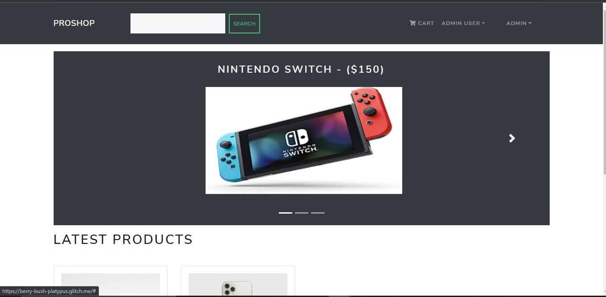

##### Main-2
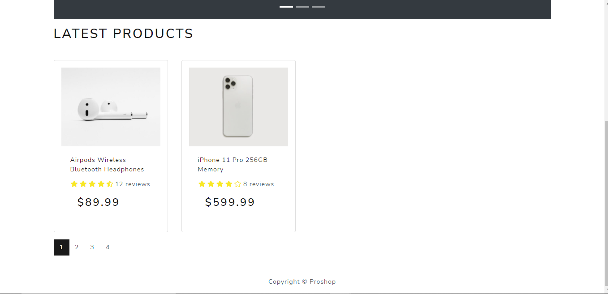

##### Singe Product Page
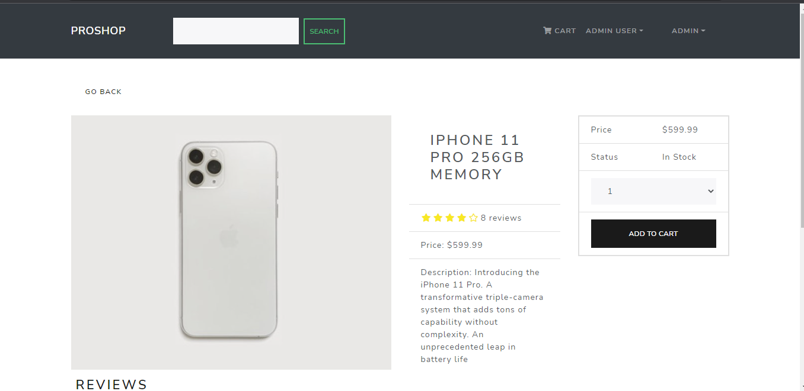

##### Review
Review section in the single product page.
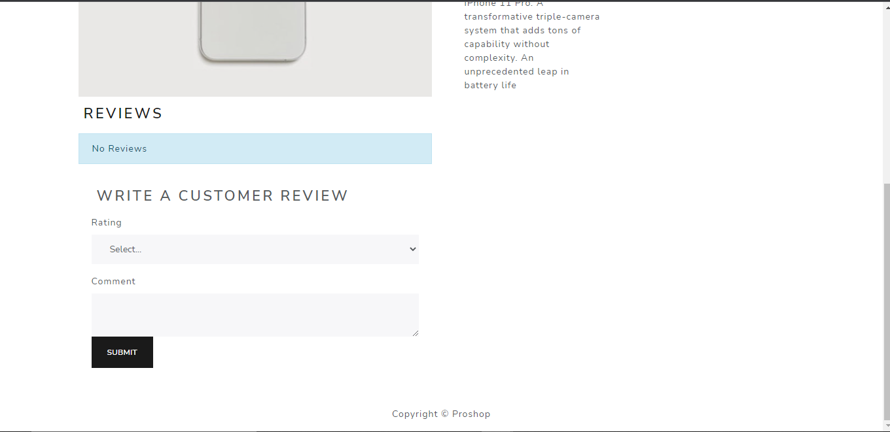

##### Rating
Users can choose from the five level of ratings from dropdown
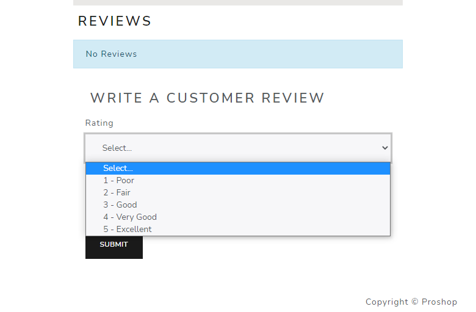

##### Out of Stock Product
When the product is out of stock, the order button will be disabled and the subsequent message "Out Of Stock" will be displayed. 
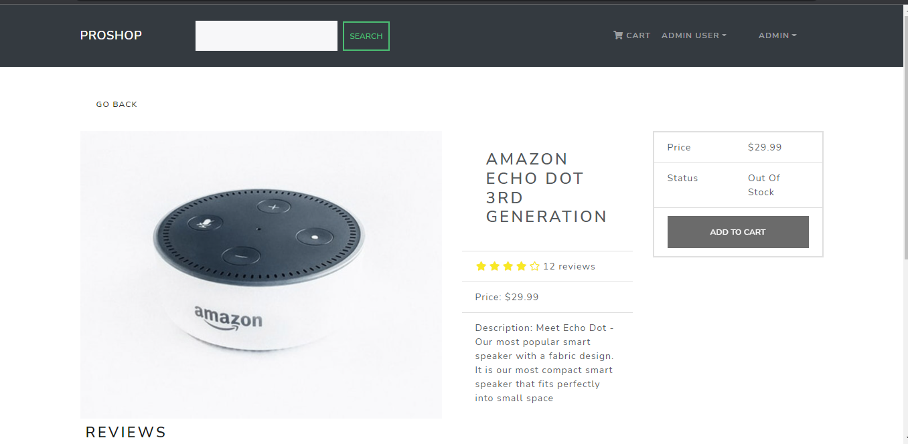

##### Cart Page
This is the cart page where the ordered items will be displayed.
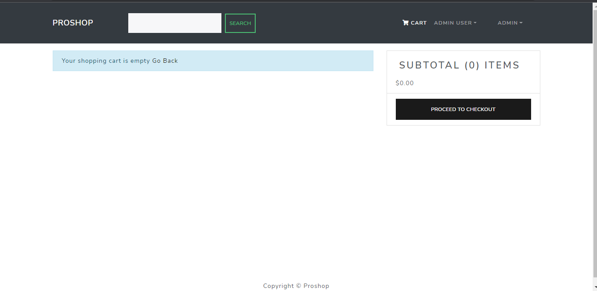

##### Users Page (Admin Only)
Admins can view the total users registered to the website.
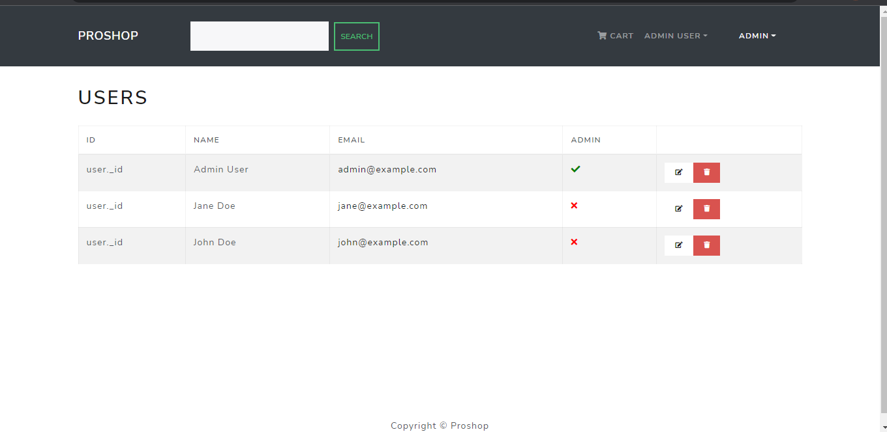

##### Products Page (Admin Only)
Admins can view as well as add new products to the website.
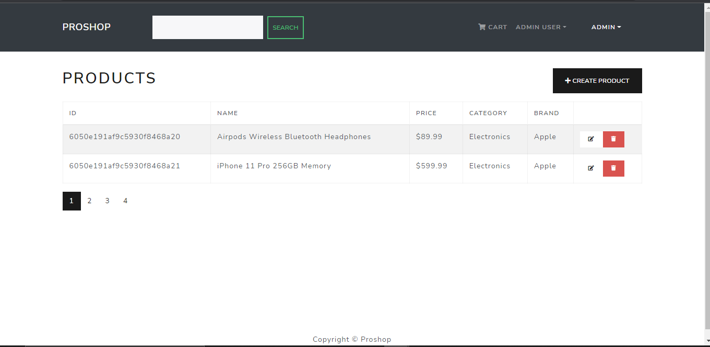

##### Orders Page (Admin Only)
Admins can view the orders made by users.
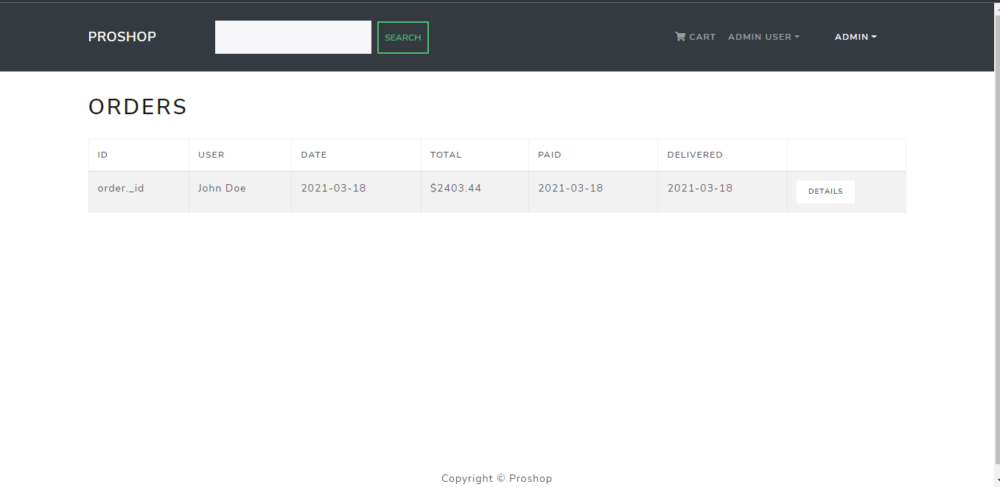

##### DropDown Options (Admin Only)
Dropdown options available to admins.
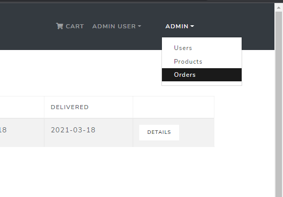

##### DropDown Options (User Only)
Dropdown options available to users.
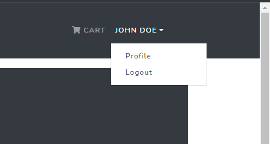

##### User View
Webpage when viewed by a user. (Only difference is in the navigation bar)
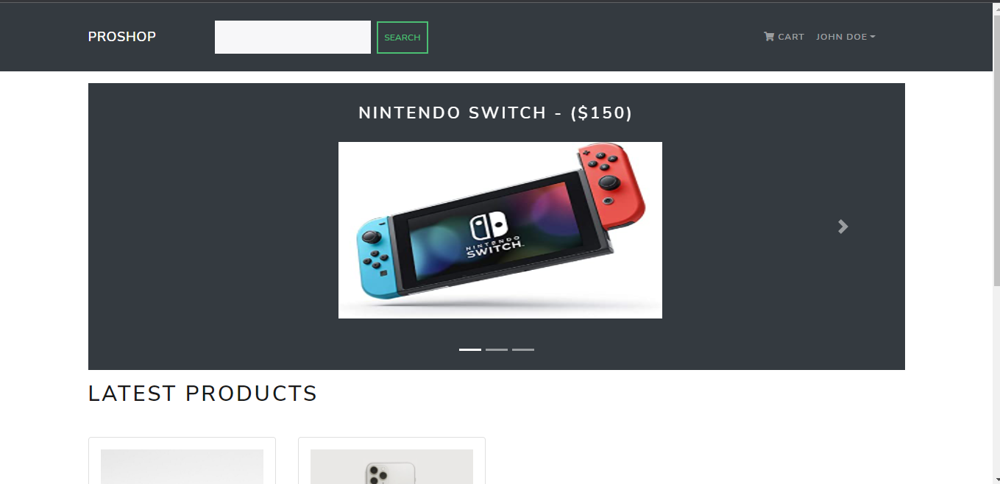

##### Signin Page
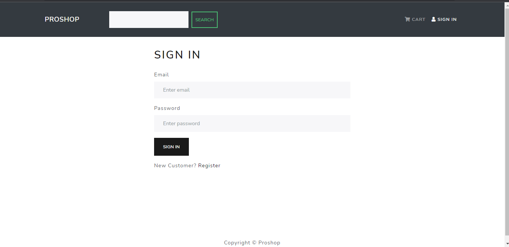

##### Signup Page
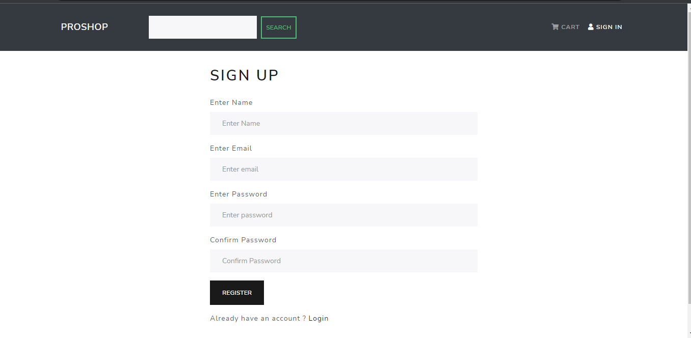

## Development

Want to contribute? Great!

This app uses MERN stack for fast developing.
Make a change in your file and instantaneously see your updates!

Open your favorite Terminal and run these commands.

Terminal:

```sh
cd ProShop
npm run dev
```
## Performance Test
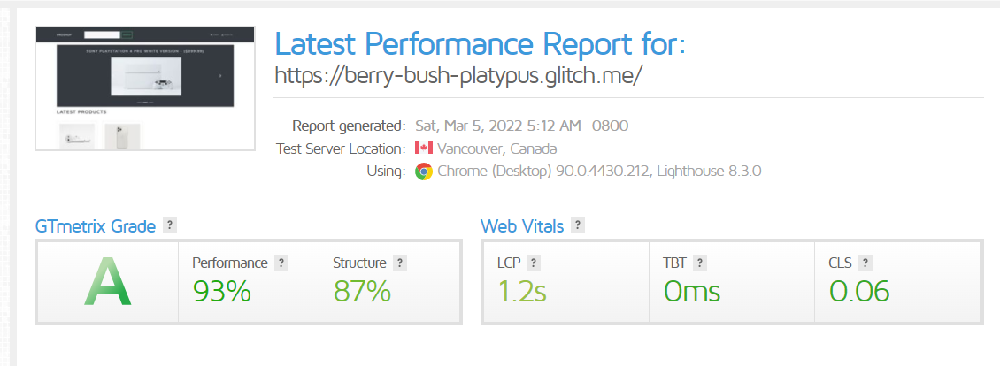

## Hosted
The link for the finished website - [Click Here](https://berry-bush-platypus.glitch.me/)

<!-- ## License

MIT -->


